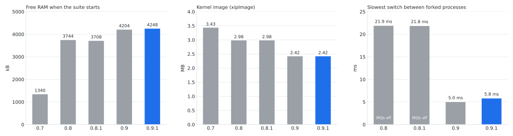

# Linux on an ESP32-S3 — native Linux that stays up

[](https://donation.streamiverse.io/paulneja)
[](CONTRIBUTING.md)

<picture>
  <source media="(prefers-color-scheme: dark)" srcset="docs/banner-dark.svg">
  
</picture>

Linux 7.2.4 running **natively on the ESP32-S3's Xtensa cores**, with WiFi,
Bash, MicroPython and writable storage. Linux is not emulated: Espressif's
firmware runs alongside it on the same chip and handles WiFi and flash access.
All of this runs on one N16R8 board, without extra RAM, an SD card or a second
computer attached to keep it running.

> [!TIP]
> **Want to help?** Hunt bugs, try it on other boards, or send fixes and
> ideas: see [CONTRIBUTING.md](CONTRIBUTING.md). And if it saved you a
> weekend, you can [chip in ❤️](https://donation.streamiverse.io/paulneja).

<p align="center">
  
</p>
<p align="center"><sub>Recorded from the board's serial console, boot to ping. Long pauses are cut to 1.6 s.</sub></p>

<p align="center">
  <a href="#quick-start">Quick start</a> ·
  <a href="#how-it-works">How it works</a> ·
  <a href="#results">Results</a> ·
  <a href="#limits">Limits</a> ·
  <a href="#documentation">Documentation</a>
</p>

## At a glance

<table>
  <tr><td>Board</td><td>ESP32-S3 N16R8: 16 MB flash, 8 MB octal PSRAM, no SD card, no extra RAM</td></tr>
  <tr><td>Cores</td><td>core 0 runs Espressif's firmware for WiFi and BLE, core 1 runs Linux</td></tr>
  <tr><td>Kernel</td><td>Linux 7.2.4, NOMMU, executed in place from flash (<a href="https://github.com/paulneja/linux-esp32s3">source</a>)</td></tr>
  <tr><td>Userland</td><td>Bash 5.2, BusyBox, Dash, MicroPython, GNU Make, dropbear, curl, nano, cron</td></tr>
  <tr><td>Boot to login</td><td>about 15.2 s, the average of 20 cold boots</td></tr>
  <tr><td>Free RAM</td><td>4248 kB of 7852 kB when the test suite starts</td></tr>
  <tr><td>fork()</td><td>supported through swapped memory banks; the slowest switches measured take 5.0 to 9.6 ms</td></tr>
  <tr><td>Network</td><td>WiFi client, SSH or Telnet, setup from a phone over Bluetooth</td></tr>
  <tr><td>Tested</td><td>36 board tests, 11 extra checks, 20 cold boots, WiFi, SSH and its ports, on every release</td></tr>
</table>

## What's new in 0.9.1

Fixes the kernel crash right after logging in over SSH (#22). It showed up
with kitty's `kitten ssh`, whose setup script makes the shell hand every
subshell a big pile of arguments. On NOMMU the kernel copied them past the
bottom of the new program's stack, over its own memory. The stack now has
room for them: patch 62 in
[linux-esp32s3](https://github.com/paulneja/linux-esp32s3).

The SSH and Telnet ports and how SSH logs in are one command now:
`remote-login port ssh 2022`, `remote-login auth key` (or `password`,
`both`), and `web-server port 8080` for the web page. They stay in
`/etc/remote-login.conf` and survive updates; see [SECURITY.md](SECURITY.md).
`./run.sh --test` also runs the extra checks, the network tests and 20 cold
boots now.

## Hardware

You need an ESP32-S3 with 16 MB of flash and 8 MB of octal PSRAM, sold as
N16R8, for example on an ESP32-S3-DevKitC-1, and a USB cable. Flashing and
the console work through the board's UART adapter or the chip's own USB port.

## Quick start

**1. Flash.** `images/` holds the 0.9.1 release. With Python 3 and esptool
installed, and nothing else holding the serial port:

```sh
git clone https://github.com/paulneja/Linux-on-esp32-S3.git
cd Linux-on-esp32-S3
./flash.sh -p /dev/ttyUSB0
```

This writes the whole 16 MB chip, `/etc` and `/home` included.

**2. Log in on the console** at 115200 baud, for example with
`screen /dev/ttyUSB0 115200`, as `root` with password `changeme123`. The
first login asks for a new password, then whether the board should answer
SSH, Telnet or neither. Only the one you pick is turned on;
`remote-login ssh|telnet|off` switches later. The ports and how SSH lets you
in can change too:

```sh
remote-login port ssh 2222            # or telnet; "default" puts 22/23 back
remote-login auth key                 # password, key, or both (the default)
remote-login status
```

Keys go in `/home/root/.ssh/authorized_keys`. The same settings live in
`/etc/remote-login.conf` (`SSH_PORT=`, `TELNET_PORT=`, `SSH_AUTH=`) if you
would rather edit them by hand; `remote-login apply` picks them up. They
survive an update like the WiFi does. `web-server port 8080` moves the web
page.

**3. Join a network:**

```sh
wifi                                  # scan and pick from a list
wifi connect "YOUR SSID" "PASSWORD"   # or directly
```

`wifi` prints the address it got, or says the password was wrong. From then
on `ssh root@<address>` works if you picked SSH. Without a cable, the board
also takes WiFi settings from a phone over Bluetooth; see [BLE.md](BLE.md).

<details>
<summary><b>Build the image yourself</b></summary>

On a Linux host with Git and Docker, `./run.sh` does everything: it checks
the environment, builds, verifies, flashes and runs the board tests. With no
arguments it opens a menu; each step is also a flag.

```sh
./run.sh                 # menu
./run.sh --all -y        # check, build, verify, flash and test, no prompts
WIFI_SSID=net WIFI_PASS=secret ./run.sh --all -y   # and the SSH tests over WiFi
```

The tests are the board suite, the extra tests, a soak of 20 factory boots
(`SOAK_ROUNDS` changes that, 0 skips it) and, given a network, SSH and the
port and login settings checked from the host. They take about an hour.

It warns before anything that erases the board and says up front how long
the build takes and how much disk it needs. `./run.sh --help` lists every
action, including `--repro` to build twice and compare, and `--recover` to
put a board back to its factory `/etc` and `/home`.

The same path by hand:

```sh
JOBS=8 bash build/reproduce.sh
./flash.sh -p /dev/ttyUSB0 --images build-output/reproduce.XXXXXX/artifacts
```

The build runs in its own directory inside a container, from pinned sources,
and writes the 16 MB `linux-esp32s3-native-full.bin`, the separate partition
images, `SHA256SUMS` and a `build-manifest.json`. The
[build guide](build/README.md) covers every step and the board tests.

</details>

<details>
<summary><b>Updating, flashing by hand, the USB port</b></summary>

`./flash.sh --parts` updates a board and keeps its data. `/home` is not
touched, and `/etc` is rewritten from the image, but on its first boot the
board puts back what it saved in `/home`: the WiFi network, the accounts and
passwords, the SSH host keys and the SSH or Telnet choice. A board updated
from 0.8.1 keeps its password and WiFi and is asked SSH or Telnet once.
`--parts --erase` wipes the chip first.

Without `flash.sh`:

```sh
esptool --chip esp32s3 --port /dev/ttyUSB0 --baud 460800 \
    write_flash --flash_mode dio --flash_size 16MB --flash_freq 80m \
    0x0 images/linux-esp32s3-native-full.bin
```

The chip's own USB port shows up as `/dev/ttyACM0`, or a COM port on
Windows, and prints the boot log. A login there is off until you run
`usb-console on` once from the UART, because its getty costs about 100 KiB
of RAM.

`Starting network (background): OK` at boot means the network was started,
not that it connected; `/var/log/network.log` has the result. The board has
no battery-backed clock, so HTTPS certificate checks can fail until NTP sets
the time.

</details>

## What runs on it

| Feature | Status | Notes |
|---|---|---|
| WiFi client | works | WPA2, DHCP, `wifi` menu, survives 100 link resets and 25 reconnects in a row |
| Setup over Bluetooth | works | any BLE serial app on a phone, see [BLE.md](BLE.md) |
| SSH | works | dropbear with a pty; `scp -O`, since there is no SFTP server |
| Telnet | works | clear text, for a trusted LAN only |
| fork() | works | up to 2 MiB per process, of which at most 512 KiB is copied on a switch; single core |
| Bash 5.2, Dash, BusyBox | works | Bash is the login shell, BusyBox is `/bin/sh` |
| MicroPython | works | fork through the `posix` module, pipes, sockets; not CPython, no `pip` |
| GNU Make, cron, dtach sessions | works | per-user crontabs, `session` to detach and reattach |
| Web page | works | edit `/home/www/index.html`, then `web-server on` |
| Hardware RSA | works | `rsa-esp32s3` in the kernel crypto API, self-tested at boot |
| HTTPS with curl | experimental | TLS 1.2 with a trimmed CA bundle, tight on RAM |
| WiFi access point | not supported | removed; the board joins networks, it does not host one |
| Other architectures' binaries | not supported | programs must be built for Xtensa FDPIC |

Things to try once logged in: `micropython /home/root/script.py`,
`crontab -e`, `session work` (detach with Ctrl-]), or
`nohup command > /tmp/job.log 2>&1 &` for a job that outlives the console.
The [userspace guide](experiments/mmu-poc/programs/USERSPACE-UPGRADE.md) has
more programs, examples and measurements.

## How it works

<picture>
  <source media="(prefers-color-scheme: dark)" srcset="docs/architecture-dark.svg">
  
</picture>

The ESP32-S3 has two cores and one WiFi radio, and Espressif only supports
that radio through its own firmware. So the chip is shared: core 0 boots
ESP-IDF, which drives WiFi and Bluetooth and then starts Linux on core 1. The
two exchange network frames, Bluetooth bytes and flash commands over shared
memory. The split comes from [Max Filippov](https://github.com/jcmvbkbc)'s
port of Linux and esp-hosted to the ESP32-S3, which this project builds on.

Linux runs without an MMU, so there are no per-process address spaces.
Programs are FDPIC binaries that run from wherever they are loaded, and the
kernel and the read-only root filesystem execute straight from flash, which
leaves the 8 MB of PSRAM almost entirely for programs.

fork() needs the child to see the parent's memory at the same addresses, and
without an MMU there is only one set of addresses. So parent and child take
turns: on every switch between them the kernel swaps their private memory in
and out. Since 0.9, aligned 64 KiB chunks are swapped by rewriting two cache
MMU entries instead of copying 128 KiB, roughly 47x faster. Small mappings
still get copied. [ARCHITECTURE.md](ARCHITECTURE.md) and the
[fork notes](experiments/mmu-poc/programs/USERSPACE-UPGRADE.md) go deeper.

<picture>
  <source media="(prefers-color-scheme: dark)" srcset="docs/fork-remap-dark.svg">
  
</picture>

## Results

Free RAM, kernel size and the slowest switch between forked processes, measured
on the board for each release:

<picture>
  <source media="(prefers-color-scheme: dark)" srcset="docs/releases-dark.svg">
  
</picture>

The same 0.9 image under load, with the MMU path turned off and on
(`fork_bank_mmu=0` and `1`):

<picture>
  <source media="(prefers-color-scheme: dark)" srcset="docs/fork-switch-dark.svg">
  
</picture>

All of it read off the board. The records are in
[`build/verification/`](build/verification/), and
[`build/plot-releases.py`](build/plot-releases.py) draws the charts from them.

### Tested on the board

Each release gets flashed and run on a real board before it's tagged. The
records name the image hash they ran on.

| Release | Board suite | Extra checks | Cold boots | Also checked | Record |
|---|---|---|---|---|---|
| 0.9.1 | 36 of 36 | 11 of 11 | 20 of 20 | SSH with a pty, SSH and Telnet on other ports, keys only, password only; the #22 crash before and after the fix | [release](build/verification/2026-10-05-fix-22.md) |
| 0.9 | 36 of 36 | 10 of 10 | 20 of 20 | WiFi stress, SSH with a pty, fork with the MMU on and off; BLE from a phone and the update from 0.8.1 on an earlier build | [release](build/verification/2026-10-04-release.md) |
| 0.8.1 | 36 of 36 | 10 of 10 | 20 of 20 | the WiFi stress that used to panic the kernel, SSH with a pty | [release](build/verification/2026-09-23-release.md) |
| 0.8 | 36 of 36 | 10 of 10 | 10 of 10 | 55 clean boots on the flash cache fix, against 10 faults in 17 before it | [release](build/verification/2026-09-14-release.md) |

A boot counts as clean only if `dmesg` and the taint flags are clean. 0.8
found out the hard way that a quiet console isn't enough.

## Limits

| Limit | Why |
|---|---|
| 8 MB of RAM | fork() copies private memory up front instead of on write, so several Bash sessions or big pipelines can run out. Detached sessions use Dash for that reason. A forked process can hold up to 2 MiB of private memory. |
| Switching between forked processes costs time | the kernel swaps their memory on every switch. The MMU handles aligned 64 KiB chunks in about 80 µs each, but small mappings such as shared library data are copied, so the slowest switches take 5 to 10 ms. |
| No copy-on-write | a write the hardware refuses raises an asynchronous interrupt, so there is no fault to resume after copying a page. |
| No memory protection between processes | without an MMU, Unix permissions are all there is. Run trusted programs. |
| One core for Linux | the fork backend is single-core and refuses multithreaded processes. |
| Writes to `/etc` and `/home` can slow down | older releases saw jffs2 writes collapse under heavy rewriting. A benchmark on 0.8.1 kept 43 to 50 KB/s up to 92 % full, but the cause is not confirmed; keep backups. See the [investigation](build/verification/2026-09-06-jffs2-erase.md). |
| Read-only root filesystem | the root is cramfs executed from flash, which is what makes it fit. Change it through the build, not on the board. |

## History

0.1 ran Linux inside a RISC-V emulator on the chip. 0.2 replaced it with a
real Linux 6.11 kernel for Xtensa, on Max Filippov's port, and the RSA
accelerator passed its self-tests from that first native boot. 0.3 dropped
the WiFi access point and added nano and the interactive `wifi`, 0.4 WiFi
setup from a phone over Bluetooth, 0.5 a faster and reproducible build, 0.6
a clock that sets itself. 0.7 brought fork() through memory banks, and with
it Bash, Make and MicroPython running real processes.

In 0.8 about one cold boot in ten had been taking a kernel fault that the
tests counted as a pass, because they took a quiet console for a clean one.
The cause was a flash cache shared by both cores that nothing invalidated
after Linux wrote to jffs2; four lines in the firmware fixed it
([incident 15](DEVELOPMENT.md)). 0.8.1 made WiFi survive being taken down
and up quickly and added the USB console. 0.9 moves to Linux 7.2.4 and the
switch through the cache MMU, and 0.9.1 fixes a crash over SSH that only
kitty triggered. Every release, with causes and measurements,
is in the [changelog](CHANGELOG.md).

## Repository layout

| Path | What is there |
|---|---|
| [`build/`](build/) | the container build, `reproduce.sh`, board tests, verification records |
| [`new-files/board/espressif/esp32s3/`](new-files/board/espressif/esp32s3/) | kernel config and series, BusyBox config, the root filesystem overlay |
| [`new-files/esp-hosted/`](new-files/esp-hosted/), [`patches/`](patches/) | the core 0 firmware: partition table, sdkconfig, patches |
| [`new-files/toolchain-patches/`](new-files/toolchain-patches/) | the uClibc-ng patch applied when the toolchain is built |
| [`experiments/mmu-poc/`](experiments/mmu-poc/) | the fork backend, the userspace programs and their tests |
| [`images/`](images/) | the flashable images of the current release |
| [`flash.sh`](flash.sh), [`run.sh`](run.sh) | flash a board, or drive the whole build and test path |

## Documentation

| File | What it covers |
|---|---|
| [ARCHITECTURE.md](ARCHITECTURE.md) | how the chip is shared, the boot, the flash layout |
| [build/README.md](build/README.md) | clean builds, artifacts and the board tests |
| [DEVELOPMENT.md](DEVELOPMENT.md) | patches, upstream sources, past incidents in detail |
| [USERSPACE-UPGRADE.md](experiments/mmu-poc/programs/USERSPACE-UPGRADE.md) | the programs, the fork implementation, measured limits |
| [BLE.md](BLE.md) | WiFi setup from a phone |
| [SECURITY.md](SECURITY.md) | the login, SSH and Telnet, what is and is not protected |
| [TROUBLESHOOTING.md](TROUBLESHOOTING.md) | when something does not work |
| [CHANGELOG.md](CHANGELOG.md) | every release, with causes and measurements |

<details>
<summary><b>Earlier releases</b></summary>

### What's new in 0.9

The kernel is now 7.2.4 (6.11 stopped getting fixes in 2024) and lives in
its own repo, [linux-esp32s3](https://github.com/paulneja/linux-esp32s3):
the kernel.org release plus 61 patches.

fork() got a lot cheaper. Most of the work now goes through the chip's cache
MMU, and the slowest switch in the same test dropped from 22 ms, with
interrupts off, to 5.0 ms.

A freshly flashed board doesn't listen on the network anymore until you log
in on the console, change the password and pick SSH or Telnet. Also fixed #20,
where a wrong WiFi password broke the next scan. The kernel is 563 KB smaller
and there's about 500 kB more free RAM than in 0.8.1.

### What's new in 0.8.1

Fixes, mostly from issues people opened. WiFi no longer panics the kernel or
leaks a DHCP client when it is taken down and up quickly (#13), `ssh
root@board` gets a terminal (#9), and `kitten ssh` from kitty works. The
boot log also comes out of the chip's own USB port, so a board with no UART
adapter can be watched; `usb-console on` adds a login there (#17). The
clean build no longer fills the disk (#12) or misses the ESP-IDF Python
environment (#16). The [changelog](CHANGELOG.md) has each cause and how it
was checked.

### What's new in 0.8

0.8 is the release where the board stops crashing. Since 0.7 about one factory
boot in ten took a kernel fault in its first seconds, and nobody knew, because
the test counted silence as a pass. The cause was in the firmware: the ESP32-S3
has one flash cache for both cores, and after every write Linux made to jffs2
nothing invalidated it, so the kernel went on reading stale pages, sometimes
of its own code. Four lines in the firmware fix it. Fifty-five factory boots in
a row came up clean on the fixed firmware, measured by a runner that reads
`dmesg` back instead of trusting a quiet console. That does not prove the
board never crashes; it shows the early-boot corruption that used to appear
in one boot of ten is no longer reproducible.

With that gone, the fork backend's page-set exchange, which had been written
off for corrupting memory, turns out never to have: it ships now, and every
program that forks needs half the memory it did. `make` and `jobq` need none,
because they spawn instead. MemAvailable after boot went from 1.3 MB to 3.7 MB.

Smaller things a person notices: `wifi connect` writes its configuration for
the first time, `bootlog verbose` turns the console back up without a rebuild,
an update no longer takes the WiFi password with it, the clock survives a
reboot, and the four dropbear host keys that every board used to share are no
longer in the image. The changelog has the rest, with the numbers.

**Fork is not a full MMU.** This remains NOMMU Linux, with no hardware process
memory protection. The switchable MMU-remap experiment is a separate runtime,
not a loader for arbitrary desktop binaries. See [limits](#limits) below.

### RAM, before and after

Both columns were read off the board through `/proc/meminfo` and
`programbench`: the 0.7 kernel in
[one record](build/verification/2026-09-12-full-image.md), the 0.8 image in
[another](build/verification/2026-09-14-final-image.md).
`build/plot-ram.py` draws the picture from them.

<picture>
  <source media="(prefers-color-scheme: dark)" srcset="docs/ram-before-after-dark.svg">
  
</picture>

The middle panel is what a program costs the fork backend beyond its own
memory: the shadow pages that keep parent and child apart. The exchange
halves it, and `make` and `jobq` spawn instead of forking, so they cost
nothing. The right panel is the floor, the lowest MemAvailable sampled while
each benchmark ran. On 0.7 bash got down to 248 kB, which is where
`fork: Cannot allocate memory` used to come from.

The middle panel again, drawn by GitHub from the numbers in this file, so
they can be checked against the records without opening the picture:

```mermaid
---
config:
  themeVariables:
    xyChart:
      plotColorPalette: "#9aa0a6, #1f6feb"
---
xychart-beta
    title "Peak fork shadow per program, kB (0.7 behind, 0.8 in front)"
    x-axis [bash, micropython, dash, make, socat, jobq]
    y-axis "kB" 0 --> 1000
    bar [892, 512, 560, 432, 296, 248]
    bar [528, 308, 280, 0, 152, 0]
```



</details>

## Credits and license

Built on the Xtensa Linux, Buildroot and esp-hosted work of
[**jcmvbkbc**](https://github.com/jcmvbkbc) (Max Filippov), and on Espressif's
firmware. See [NOTICE](NOTICE) for third-party components and licenses.
The people who helped along the way are in [THANKS.md](THANKS.md).

This project is licensed under the **GPLv3** (see [LICENSE](LICENSE)). Kernel
code contributed here, such as `drivers/crypto/esp32s3_rsa.c` and the fork
backend, is under the GPL-2.0 like the rest of the kernel; each file's SPDX
header gives the exact terms. The kernel tree lives in
[linux-esp32s3](https://github.com/paulneja/linux-esp32s3).
